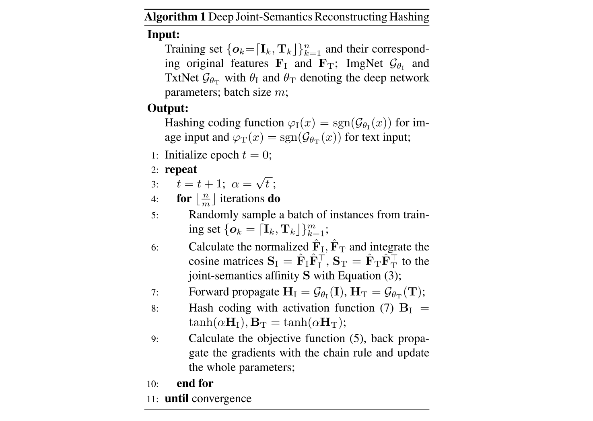

## Deep Joint-Semantics Reconstructing Hashing for Large-Scale Unsupervised Cross-Modal Retrieval

### Introduction

### Joint-Semantics Reconstructing Hashing

变量定义：

* $m$：批的大小；
* $\mathcal{O}$：批，即 $\{o_k = \lceil \mathrm{I}_k, \mathrm{T}_k \rfloor\}_{k = 1}^m$，每个元素为图片-文本对。图片和文本的特征矩阵分别为 $\mathrm{F}_\mathrm{I} \in \mathbb{R}^{m \times p_I}$ 和 $\mathrm{F}_\mathrm{T} \in \mathbb{R}^{m \times p_T}$；
* $\mathrm{B}_\mathrm{I} \in \{\pm1\}^{m\times d}$ 和 $\mathrm{B}_\mathrm{T} \in \{\pm1\}^{m\times d}$：表示 $\mathrm{I}_k$ 和 $\mathrm{T}_k$ 分别通过 ImgNet 和 TxtNet 编码后生成的二值向量；
* $\hat{\mathrm{F}}_\mathrm{I}$ 和 $\hat{\mathrm{F}}_\mathrm{T}$：表示归一化后的 $\mathrm{F}_\mathrm{I}$ 和 $\mathrm{F}_\mathrm{T}$，则余弦相似度为
$$
\mathrm{S}_\mathrm{I} = \hat{\mathrm{F}}_\mathrm{I}\hat{\mathrm{F}}_\mathrm{I}^\top \in [-1, +1]^{m \times m} 
$$
$$
\mathrm{S}_\mathrm{T} = \hat{\mathrm{F}}_\mathrm{T}\hat{\mathrm{F}}_\mathrm{T}^\top \in [-1, +1]^{m \times m}
$$

$\mathrm{B}$ 可以看作单位超立方体的顶点，相邻的点具有相似的哈希值。其 Hamming 距离可以用角距离来代替，即两个向量夹角的 cos 值。

***Constructing Joint-Semantics Matrix***

考虑使用上面的 $\mathrm{S}_\mathrm{I}$ 和 $\mathrm{S}_\mathrm{T}$ 指导哈希码的学习。一种传统的方法是

$$
\min_{\mathrm{B}} \beta \mathrm{Tr}(\mathrm{B}^\top\mathrm{L_I}\mathrm{B}) + (1 - \beta)\mathrm{Tr}(\mathrm{B}^\top\mathrm{L_T}\mathrm{B})~~~\mathrm{s.t.}~ \mathrm{B} \in \{\pm1\}^{m \times d}
$$

其中

$$
\mathrm{L_I} = \mathrm{diag}(\mathrm{S_11}) - \mathrm{S_I}
$$
$$
\mathrm{L_T} = \mathrm{diag}(\mathrm{S_T1}) - \mathrm{S_T}
$$

本文构造 Joint-semantics Affinity Matrix，定义组合函数 $\mathcal{C}$，

$$
\mathrm{S} = \mathcal{C}(\mathrm{S_I}, \mathrm{S_T}) \in [-1, +1]^{m \times m}
$$

其中 $\mathrm{S}_{ij}$ 表示实例 $o_i$ 和 $o_j$ 的潜在语义相度。令

$$
\tilde{\mathrm{S}} = \beta \mathrm{S_I} + (1 - \beta) \mathrm{S_T}
$$
$$
\begin{aligned}
\mathrm{S} &= \mathcal{C}(\mathrm{S_I}, \mathrm{S_T}) \\
&= (1 - \eta) \tilde{\mathrm{S}} + \eta \frac{\tilde{\mathrm{S}}\tilde{\mathrm{S}}^\top}{m} \\
&= (1 - \eta)[\beta \mathrm{S_I} + (1 - \beta)\mathrm{S_T}] + \frac{\eta}{m}[\beta^2\mathrm{S_I}\mathrm{S_I}^\top + \beta(1 - \beta)(\mathrm{S_I}\mathrm{S_T}^\top + \mathrm{S_T}\mathrm{S_I}^\top) + (1 - \beta^2)\mathrm{S_T}\mathrm{S_T}^\top]
\end{aligned}
$$

上述式子可以看成 diffusion process 的一次迭代。

***Reconstructing with Binary Codes***

目标是最小化

$$
\min_{\mathrm{B_I},\mathrm{B_T}} || \mu\mathrm{S} - \cos(\mathrm{B_I}, \mathrm{B_T})||_\mathrm{F}^2, ~~~\mathrm{s.t.}~ \mathrm{S} = \mathcal{C}(\mathrm{S_I}, \mathrm{S_T}) \in [-1, +1]^{m \times m}
$$

这里 $\mu$ 是超参数，可以用来调节归约到 $\pm 1$ 上的范围程度。相比拉普拉斯约束

$$
\mathrm{Tr}(\mathrm{B}^\top\mathrm{L}\mathrm{B}) = \sum_{i, j} \mathrm{S}_{ij} ||\mathrm{B}_i - \mathrm{B}_j||^2
$$

相当于从中间的乘号变成减号，减少了一个 batch 里的过拟合现象，更适合分批学习。进一步加入相同模态内的约束条件，最后的目标函数为

$$
\begin{aligned}
\min_{\mathrm{B_I},\mathrm{B_T}} || \mu\mathrm{S} - \cos(\mathrm{B_I}, \mathrm{B_T})||_\mathrm{F}^2 + \lambda_1 || \mu\mathrm{S} - \cos(\mathrm{B_I}, \mathrm{B_I})||_\mathrm{F}^2 + \lambda_2 || \mu\mathrm{S} - \cos(\mathrm{B_T}, \mathrm{B_T})||_\mathrm{F}^2, \\ \mathrm{s.t.}~ \mathrm{S} = \mathcal{C}(\mathrm{S_I}, \mathrm{S_T}) \in [-1, +1]^{m \times m},~ \mathrm{B_I}, \mathrm{B_T} \in  \{-1, +1\}^{m \times d} 
\end{aligned}
$$

***Optimization***

用 $\mathrm{H} \in \mathbb{R}^{m \times d}$ 统一表示 ImgNet 和 TxtNet 最后一层的输出（没有激活函数），则

$$
\mathrm{B} = \mathrm{sgn}(\mathrm{H}) \in \{-1, +1\}^{m \times d}
$$

由于符号函数的梯度大部分为 0，故改为使用如下函数

$$
\mathrm{B} = \mathrm{tanh}(\alpha\mathrm{H}) \in \{-1, +1\}^{m \times d},~ \alpha \in \mathbb{R}^+
$$

整个算法的流程图如下所示

