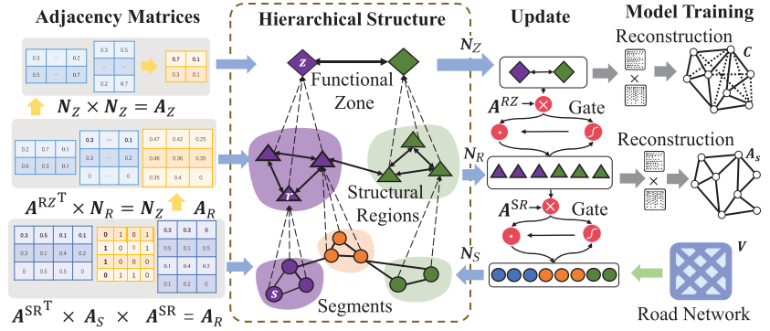
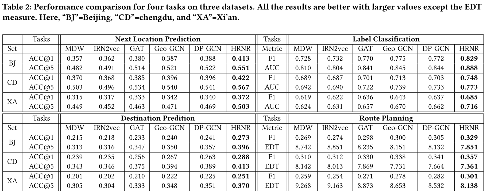
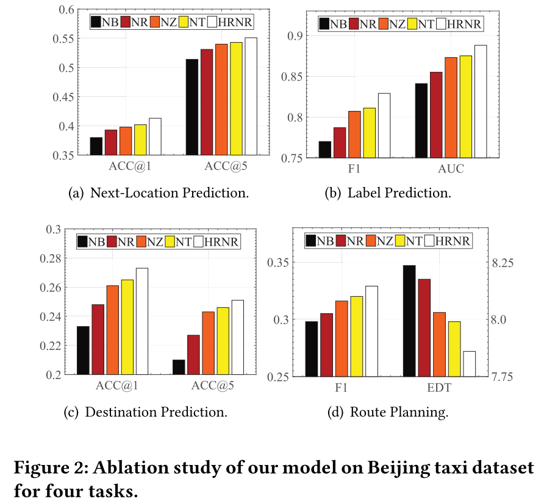
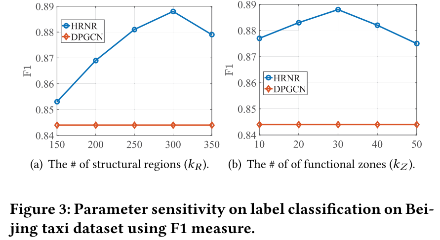
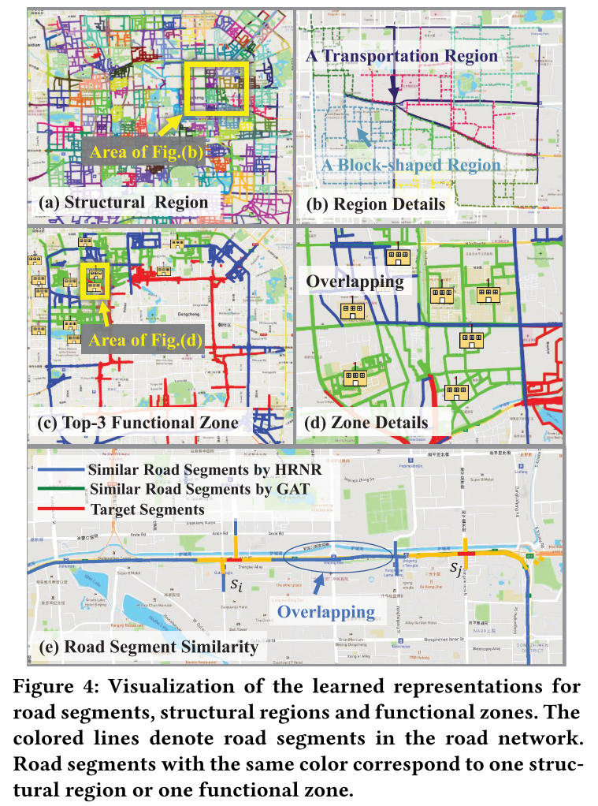

## Learning Effective Road Network Representation with Hierarchical Graph Neural Networks

### Abstract

道路网络是城市交通的核心组成部分，在与交通相关的各种系统和应用中有着很大作用。因此，开发通用的、有效的、鲁棒的路网表示模型至关重要。虽然已有工作在这方面作出了一些努力，但它们不能完全捕捉到路网的复杂特征。

在本文中，我们提出了一种新的分层道路网络表示（Hierarchical Road Network Representation）模型，通过构建一个三级神经网络结构，分别对应“功能区”、“结构区”和“路段”。为将这三者关联起来，我们引入两个由概率分布组成的矩阵，用于建模分段-区域分配或区域-区域分配。基于这两个分配矩阵，我们精心设计了两个重构任务，要么基于网络结构，要么基于人的移动模式。通过这种方式，我们的节点表示（node presentions）能够同时捕捉结构和功能特征。最后，我们设计了一个三层次的更新机制来学习整个网络的节点嵌入。在四个任务的三个真实数据集上的大量实验结果表明了该模型的有效性。

### Introduction

路网是城市地区最基本的交通基础设施，从而要使用有效的方法描述和建模道路网络。最早使用传统的图数据结构来开发算法，最近有工作使用深度表示学习来研究这个问题。这样路网的潜在特征就可以被提取和利用，从而有望提高下游应用程序的性能。

路网的表示学习有三个亟待解决的问题：首先，路网并不是平整的（flat），它自然地或结构性或功能性地把交通单元组织成集群，而且有些交通单位相比之下更为重要，在路网中承担更重要的运输任务（很多之前的工作使用标准的 GNN，不能很好地表征等级结构）；其次，路网很大，其中的路的平均距离很长（而一般的 GNN 只聚合来自邻近节点的消息，不能有效地捕获节点之间的远程依赖关系）；最后，路网主要体现的是结构特征，而其他方面的信息可能无法通过网络结构获得。

我们的使用层次图神经网络来学习路网的表示，且在网络中加入结构区域和功能区域，并使用用户的真实轨迹来补充其他信息。我们的贡献主要有：

1. 据我们所知，这是第一次用层次图神经网络学习道路网络表示，同时捕捉结构和功能特征。 
2. 我们的模型能够自然地模拟道路网络上遥远节点之间的远程依赖关系，并利用轨迹数据提取功能特征。
3. 我们的模型为各种下游交通相关问题提供了一种通用的表示学习方法。
4. 我们利用三个真实世界的数据集在四个典型的应用任务上构建了广泛的实验。实验结果验证了该模型的有效性。

### Problem Statement & Methodology

路段 $s \in \mathcal{S}$ 是在运输过程中有单独标识的统一路段。路网是一张有向图 $\mathcal{G} = \langle \mathcal{S}, A_{\mathcal{S}} \rangle$，路段集合 $\mathcal{S}$ 的大小为 $k_\mathcal{S}$，0/1 矩阵 $A_{\mathcal{S}} \in \mathbb{R}^{k_\mathcal{S} \times k_\mathcal{S}}$ 为其邻接矩阵。结构区域 $r \in \mathcal{R}~(|\mathcal{R}| = k_\mathcal{R})$ 由在空间上相连的路段组成，其扮演交通角色，如天桥和人行横道。功能区域 $z \in \mathcal{Z}~(|\mathcal{Z}| = k_\mathcal{Z})$ 包括多个结构区域，提供某些交通功能，如购物区和中转港。

一个分层的道路网络表示为 $\mathcal{H} = \langle \mathcal{V}, \epsilon \rangle$，其中 $\mathcal{V} = \mathcal{S} \cup \mathcal{R} \cup \mathcal{Z}$，$\epsilon = \{A_\mathcal{S}, A_\mathcal{R}, A_\mathcal{Z}, A^{\mathcal{S}\mathcal{R}}, A^{\mathcal{R}\mathcal{Z}} \}$ 分别表示路段、结构区域、功能区域、路段和结构区域、结构区域个功能区域之间的邻接矩阵。后四者要通过学习得到。

路网表示学习是指给定路网 $\mathcal{G}$，构造分级网络 $\mathcal{H}$，并对其中的每个节点给出向量表示 $n_m \in \mathbb{R}^d$，同时给出上面的邻接矩阵。定义 $N_\mathcal{S} \in \mathbb{R}^{k_\mathcal{S} \times d},~N_\mathcal{R} \in \mathbb{R}^{k_\mathcal{R} \times d},~N_\mathcal{Z} \in \mathbb{R}^{k_\mathcal{Z} \times d}$ 为上述向量的聚合。

HRNR 的总体框架如下：

#### Contextual Embedding for Road Segments

对于路段 $s_i$，我们从路段 ID、道路类型（RT）、车道数量（LN）、路段长度（SL）和经纬度（LL）五个特征对其进行编码。对于连续特征，先将其分段离散化。则

$$
v_{s_i} = v_{ID} || v_{RT} || v_{LN} || v_{SL} || v_{LL}
$$

将上面的特征矩阵 $V$ 作为 GNN 的初始化，$N_{\mathcal{S}}^{(0)} \leftarrow V$。

#### Modeling Structural Regions

使用传统的谱聚类（spectral clustering）来得到结构区域。这种聚类算法特别适合我们的任务，因为我们的目标是寻找紧密相连的路段，以得到某些交通目的的局部联通模式。令

$$
L_{\mathcal{S}} = D_{\mathcal{S}} - A_{\mathcal{S}}
$$

分解 $L_{\mathcal{S}}$ 的 $d'$ 个特征向量得到特征矩阵 $U \in \mathbb{R}^{k_\mathcal{S} \times d'}$。对其进行 K 聚类，可以得到地点到聚类的映射，定义矩阵 $M_1 \in \mathbb{R}^{k_\mathcal{S} \times k_\mathcal{R}}$ 当且仅当 $l \in r$ 时 $M_1[l, r]$ 取 1，其余取 0。

由于聚类中不同道路段的重要性并不相同，因此我们采用 GAT 进行建模，

$$
W_1 = \mathbf{GAT}(V, A_{\mathcal{S}}) \in \mathbb{R}^{k_\mathcal{S} \times k_\mathcal{R}}
$$

$W_1$ 的列向量相当于衡量了区域中路段的重要性，从而得到

$$
A^{\mathcal{S}\mathcal{R}} = \mathbf{softmax}(M_1 ⊙ W_1)
$$

其中 $⊙$ 为矩阵按位置相乘符号。其中 $A^{\mathcal{S}\mathcal{R}}$ 实际上建模了路段在结构区域中出现的概率，即 $A^{\mathcal{S}\mathcal{R}}[s,r] = \mathbf{Pr}(s \mid r)$。进一步有

$$
N_{\mathcal{R}} = A^{{\mathcal{S}\mathcal{R}}^T} N_{\mathcal{S}}
$$

实际上有 $n_r = \sum_{s \in r} \mathbf{Pr}(s \mid r)n_s$。那么结构区域间的邻接矩阵为

$$
A_{\mathcal{R}} = A^{{\mathcal{S}\mathcal{R}}^T} \cdot A_{\mathcal{S}} \cdot  A^{\mathcal{S}\mathcal{R}}
$$

这个公式可以解释为

$$
A_\mathcal{R}[r_i, r_j] = \sum_{s, s' \in \mathcal{S}} \mathbf{Pr}(s \mid r_i) \mathbf{Pr}(s' \mid r_j)A_{\mathcal{S}}[s, s']
$$

为了训练 $A^{\mathcal{S}\mathcal{R}}$，我们令 $\hat{N}_\mathcal{S} = A^{\mathcal{S}\mathcal{R}}N_\mathcal{R}$，即 $n_s = \mathbf{Pr}(s \mid r_s)n_r$，$r_s$ 为路段 $s$ 所在的结构区域。用 $\hat{N}_\mathcal{S}$ 反推邻接矩阵 $A_{\mathcal{S}}$，则

$$
\hat{A}_\mathcal{S} = \mathbf{sigmoid} (\hat{N}_\mathcal{S} \hat{N}_\mathcal{S}^T)
$$

损失函数为（交叉熵）

$$
Loss_1 = \sum_{s_i, s_j \in \mathcal{S}} -A_\mathcal{S}[s_i, s_j] \log (\hat{A}_\mathcal{S}[s_i, s_j]) - (1 - A_\mathcal{S}[s_i, s_j]) \log (1 - \hat{A}_\mathcal{S}[s_i, s_j])
$$

#### Modeling Functional Zones

功能区域是建立在功能相关的结构区域之上的。它的目的是捕捉重要的功能特征，功能区域之间可能并不相连甚至相距很远。和上一部分类似，

$$
A^{\mathcal{R} \mathcal{Z}} = \mathbf{softmax}(M_2) \in \mathbb{R}^{k_{\mathcal{R}} \times k_\mathcal{Z}}
$$
$$
M_2 = \mathbf{GAT}(N_{\mathcal{R}}, A_\mathcal{R}) \in \mathbb{R}^{k_{\mathcal{R}} \times k_\mathcal{Z}}
$$
$$
N_{\mathcal{Z}} = A^{{\mathcal{R}\mathcal{Z}}^T} N_{\mathcal{R}}
$$
$$
A_{\mathcal{Z}} = \mathbf{RELU}(N_\mathcal{Z}N_\mathcal{Z}^T - \sigma)
$$

我们使用轨迹来捕捉更多的信息，构建路段转移矩阵 $T^{(\lambda)} \in \mathbb{R}^{k_\mathcal{S} \times k_\mathcal{S}}$ 表示走 $\lambda$ 步后从路段 $s_i$ 到 $s_j$ 的概率，则

$$
C = A_\mathcal{S} + \sum_{j = 1}^\lambda T^{(j)}
$$

其中  $C$ 从路网结构和人的移动行为两个方面考虑了连通性，$\lambda$ 是超参数。为了进行训练，考虑到 $n_s = \mathbf{Pr}(s \mid r_s) \sum_{z \in \mathcal{Z}} \mathbf{Pr}(r_s \mid z)n_z$，有

$$
\hat{N}_\mathcal{S} = A^{\mathcal{S}\mathcal{R}}A^{\mathcal{R}\mathcal{Z}}N_\mathcal{Z}
$$
$$
\hat{C} = \hat{N}_\mathcal{S} \hat{N}_\mathcal{S}^T
$$
$$
Loss_2 = || C - \hat{C} ||^2
$$
 
#### Hierarchical Update Mechanism

我们使用分层更新机制来更新参数。

*功能区域更新*：使用 GCN 的更新方法

$$
N_{\mathcal{Z}}^{(t + 1)} = \mathbf{GCN}(N_{\mathcal{Z}}^{(t)}, A_{\mathcal{Z}})
$$
$$
\tilde{N}_{\mathcal{R}}^{(t)} = N_{\mathcal{R}}^{(t)} + g^{\mathcal{ZR}} ⊙ (A^{\mathcal{RZ}}N_{\mathcal{Z}}^{(t + 1)})
$$
$$
g^{\mathcal{ZR}} = \mathbf{sigmoid}((N_{\mathcal{R}}^{(t)}|| (A^{\mathcal{RZ}}N_{\mathcal{Z}}^{(t + 1)})) \cdot w_1)
$$

*结构区域更新*：类似与上面的更新

$$
N_{\mathcal{R}}^{(t + 1)} = \mathbf{GCN}(\tilde{N}_{\mathcal{R}}^{(t)}, A_{\mathcal{R}})
$$
$$
\tilde{N}_{\mathcal{S}}^{(t)} = N_{\mathcal{S}}^{(t)} + g^{\mathcal{RS}} ⊙ (A^{\mathcal{SR}}N_{\mathcal{R}}^{(t + 1)})
$$
$$
g^{\mathcal{RS}} = \mathbf{sigmoid}((N_{\mathcal{S}}^{(t)}|| (A^{\mathcal{SR}}N_{\mathcal{R}}^{(t + 1)})) \cdot w_2)
$$

*路段更新*：

$$
N_{\mathcal{S}}^{(t + 1)} = \mathbf{GCN}(\tilde{N}_{\mathcal{S}}^{(t)}, A_{\mathcal{S}})
$$

其中 $w_1,~w_2$ 通过训练得到。在训练时，先得到 $A^{\mathcal{SR}}$ 和 $A^{\mathcal{RZ}}$，再通过上面的层次更新。

### Experiment

使用下一位置预测（Next-Location Prediction）、路段标签分类（Label Classification）、终点预测（Destination Prediction）和路径规划（Route Planning）四个下游任务来测试模型的效果，结果如下

为验证结构区域和功能区域对结果是否有帮助，我们做了对比实验

我们对不同的参数大小也进行了实验，

最后，我们对模型进行了可视化的定性分析

### Extra Information

* 数据集：https://outreach.didichuxing.com/appEn-vue/dataList ，滴滴数据集。
* 无代码。

### Comment

* Abstract 是 Introduction 中间某一段的改写，非常离谱。
* 使用谱聚类时聚类数量应该恰好为 $k_\mathcal{R}$。
* $A_{\mathcal{Z}}$ 的公式展开来其实与 $A_{\mathcal{R}}$ 的公式本质上类似，但为什么要这么设置还有待思考。
* 文章中的功能区域是凌驾于在结构区域之上，但是感觉这种递进性并没有那么明显。核心问题是说明为什么路段的集合能作为功能区块的基本组成部分。