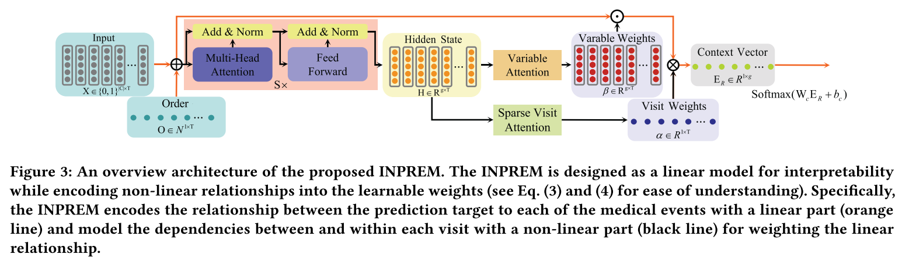

## INPREM: An Interpretable and Trustworthy Predictive Model for Healthcare

### Abstract

建立基于历史电子健康记录（Electronic Health Records, EHRs）的预测模型用于个性化医疗已经成为一个活跃的研究领域。得益于强大的特征提取能力，深度学习方法在许多临床预测任务中取得了良好的性能。然而，由于缺乏**可解释性和可信度**，深度学习方法很难应用于实际的临床决策案例中。为了解决这个问题，在本文中，我们提出了一个可解释和可信的预测模型（INPREM）来应用于医疗保健。*首先*，INPREM 被设计为可解释性的线性模型，同时将非线性关系编码到学习权中，以建模每次访问之间和访问内部的依赖关系。这使得我们可以得到输入变量的贡献矩阵，作为预测结果的佐证，并帮助医生理解为什么这个模型会给出这样的预测，从而使模型更易于解释。*其次*，为了可靠性，我们在模型的每个权重上放置一个随机门（它遵循伯努利分布来打开或关闭），以及一个额外的分支来估计数据噪声。该模型利用蒙特卡罗采样和一个目标函数来计算数据噪声，能够准确地反映预测结果的不确定性。捕获的不确定性可以让医生知道模型有多自信，从另一种角度使模型更可信。我们的经验证明，提出的 INPREM 比现有的方法有显著的优势。我们以一个案例来说明贡献矩阵和捕获的不确定性如何被用来帮助医生做出稳健的决定。

### Introduction

EHR 数据固有的特性，如即时性、异质性、高维性和偏差性，给传统的数据挖掘方法带来了障碍。在医学事件的预测上，SOTA 的模型不出意外也是由深度学习方法达到的。

但是由于深度学习天生的可解释性上的缺陷，使得医生很难理解模型的输出，也很难从输出反过来对医生进行指导。它们不能告诉医生哪些医疗事件与输出结果最相关，也不能让医生知道预测的概率可信度有多大。

在临床中，模型的可解释性要求模型能够识别每个医学事件对相应预测结果的贡献。文章从两个方面评价模型的优劣：可解释性（interpretability）和可信度（trustworthiness）。希望既能对模型进行解释，也能对模型结果给出一个可信度（即预测结果的不确定性）。可信度并不简单地通过 softmax 所得到的概率值表达。

深度学习中的不确定性分为两种：
* 偶然不确定性（aleatoric uncertainty）：由观测中的固有噪声引起，包括传感器噪声、记录错误和丢失等。
* 认知不确定性（epistemic uncertainty）：表示模型参数的不确定性。

第一种不确定性不能通过增大数据量来降低，而第二种可以。模型参数的不确定性表明模型参数实际上是分布而并非常值，训练分布型参数的常用办法是贝叶斯神经网络（BNN）和高斯过程（Gaussian process）。

本文的主要贡献如下:

* 我们提出 INPREM，一种端到端、新颖和稳健的模型来预测患者未来的健康状况，它不仅可以输出结果的概率，而且可以提供佐证来协助预测。
* 经验表明，由于设计良好的模型结构和不确定性建模，所提出的 INPREM 比现有的方法有显著的优势。
* 通过可视化和分析由蒙特卡罗抽样得到的输入贡献矩阵和概率分布，我们证明了由 INPREM 提供的额外信息可以帮助医生做出更稳健的决策。

### Method

我们将 EHR 中的医疗事件以医疗代码的的形式记录，即 $c_1, c_2, \cdots, c_{|\mathcal{C}|} \in \mathcal{C}$。同一个病人的一系列 EHR 被记为 $v_1, v_2, \cdots, v_T$，其中 $v_t \in \{0, 1\}^{|\mathcal{C}|}$，所有记录组成输入矩阵 $\mathbf{X} \in \{0, 1\}^{|\mathcal{C}| \times T}$。

本文主要处理诊断预测（Diagnosis Prediction）和疾病风险评估（Disease Risk Prediction）两个问题：

* 诊断预测：也被称为 ESM（Encounter Sequence
Modeling），通过 $v_1, v_2, \cdots, v_T$ 预测 $v_{T + 1}$。
* 疾病风险评估：上面问题的特殊情况，预测某个医疗事件的结果，但需要在一定的时间阈值之前便给出预测。

我们用线性部分和非线性部分来构建框架。结构图如下：

#### *可解释的线性模型*

先对输入进行嵌入向量表示，

$$
\mathbf{E}_v = \mathbf{W}_v \mathbf{X} \in \mathbb{R}^{g \times T}
$$

而由于之后的注意力机制会损失时序信息，我们引入 Order 的嵌入 $\mathbf{E}_o = \mathbf{W}_o \mathbf{O}$，其中 $\mathbf{O} \in \mathbb{N}^{1 \times T}$。由此，我们可以得到病患级别的向量表示 $\mathbf{E}_R \in \mathbb{R}^{1 \times g}$

$$
\mathbf{E}_R = \alpha(\beta \odot (\mathbf{E}_g + \mathbf{E}_o))^T
$$

其中，$\alpha \in \mathbb{R}^{1 \times T}$ 是与各个医疗记录（visit）的依赖关系；$\beta \in \mathbb{R}^{g \times T}$ 是每个医疗记录中每个医疗事件（event）的依赖关系；$\odot$ 为按位置相乘运算。最后通过全连接得到结果，

$$
\tilde{y} = \mathbf{W}_c^T \mathbf{E}_R^T + b_c
$$
$$
y^* = \mathbf{softmax}(\tilde{y})
$$

注意，疾病风险评估本质上是一种二分类，而诊断预测则可以视为多个二分类。

联合上面的式子，有

$$
y^* = \mathbf{softmax}(\mathbf{W}_c^T \sum_{i = 1}^T \sum_{j = 1}^{\mathcal{|C|}} \alpha[i] \beta[;, i] \odot (v_i[j]\mathbf{W}_v[:,j] + i\mathbf{W}_o) + b_c)
$$

则每个医疗事件的贡献为

$$
\mathbf{CM}[i,j] = \mathbf{W}_c^T (\alpha[i] ~ \beta[:, i] \odot \mathbf{W}_v[:, j])
$$

#### *非线性依赖的建模*

### Comment

* 在可解释性中，初始的 embedding 由于是线性变换，也可以直接计算对最后结果的贡献。