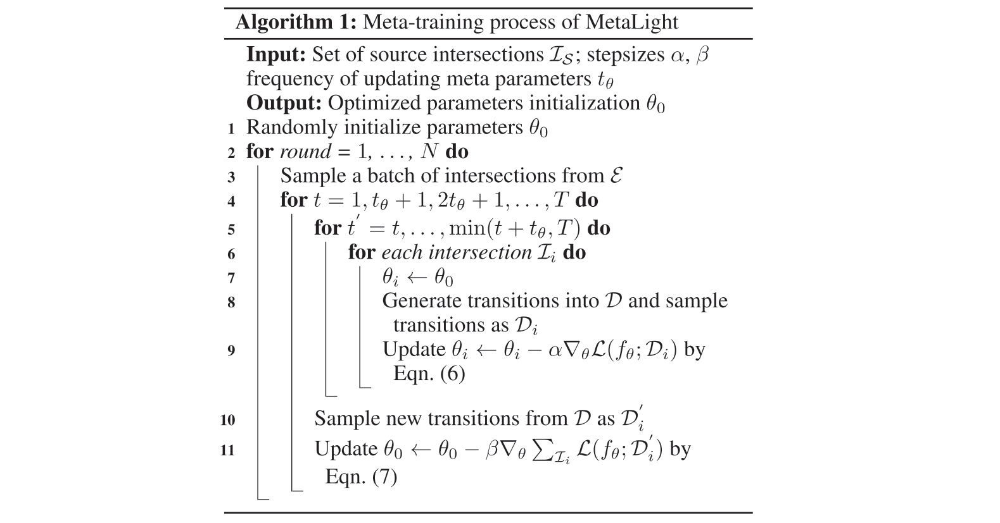
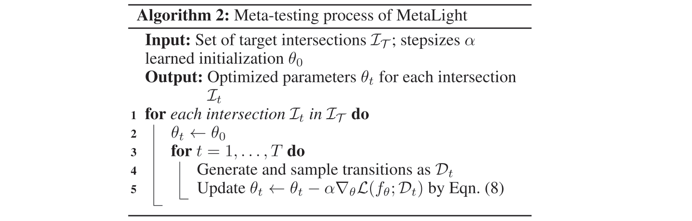
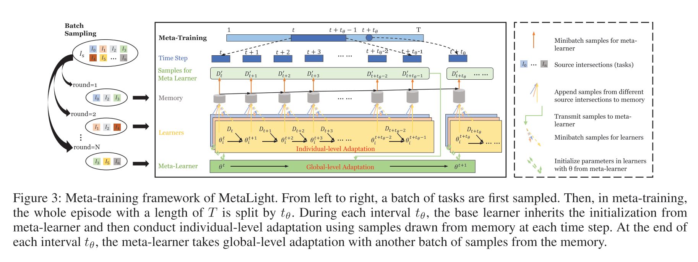

## MetaLight: Value-Based Meta-Reinforcement Learning for Traffic Signal Control

### Introduction

将元强化学习（Meta-reinforcement learning）引入信号灯控制算法中（FRAP）。

元学习分为两种，一种是通过外部记忆储存之前学习到的知识，并在之后的训练中重用；另一种是学习到一种最优参数初始化或者优化器，例如 model-agnostic meta-learning（MAML）。

### Problem Statement

根据元学习的传统定义，在任务的概率分布 $\varepsilon$ 上采样 $N_t$ 个十字路口

$$
\mathcal{L}_\mathcal{S} = \{\mathcal{L}_1, \cdots, \mathcal{L}_{N_t}\}
$$

每个十字路口 $\mathcal{L}_i$ 的控制过程可以视为一个马尔可夫决策过程

$$
\langle \mathcal{S}_i, \mathcal{A}_i, \mathcal{R}_i, \mathcal{\gamma}_i, H_i \rangle
$$

其中 $\mathcal{S}_i$ 为有限的状态集合，$\mathcal{A}_i$ 为有限的动作集合，$\mathcal{R}_i$ 为奖赏函数，$\gamma_i$ 为折扣因子，$H_i$ 为一个 episode 的长度。$\mathcal{R}_i(s, a)$ 定义为

$$
\mathcal{R}_i(s, a) = \mathbb{E}[\mathcal{R}_{t + 1} \mid \mathcal{S}_i(t) = s, \mathcal{A}_i = a]
$$

价值函数为

$$
Q(s, a; f_\theta) = \mathbb{E}[r_i(t) + \gamma_i r_i(t + 1) + \cdots \mid s_i(t) = s, a_i(t) = a]
$$

令 $f$ 为参数为 $\theta$ 的基础学习器，损失函数定义为

$$
\mathcal{L}(f_{\theta_i}) = \mathbb{E}_{s,a,r,s' \sim \mathcal{D}_i} \left[\left(r + \gamma \max_{a'} Q(s', a'; f_{\theta_i^-}) - Q(s, a; f_{\theta_i})\right)^2\right]
$$

其中，$\theta_i^-$ 是 FRAP 中 target 网络的参数，对于每 $C$ 次迭代是固定的。算法的目标是学习到一个普遍的 meta-learner $\mathcal{M}$，学习过程类似于 MAML 的两步更新

$$
\{\theta_i, \cdots, \theta_{N_t}\} = \min_{\{\theta_i, \cdots, \theta_{N_t}\}} \sum_{i = 1}^{N_t} \mathcal{L}(\mathcal{M}(f_{\theta_i}; \mathcal{D}_i))
$$

$$
\mathcal{M} = \min_{\mathcal{M}} \sum_{i = 1}^{N_t} \mathcal{L}(\mathcal{M}(f_{\theta_i}; \mathcal{D}_i'))
$$

### The MetaLight Framework

对 FRAP 的改进主要有

* 一个 phase 车道之间的信息用取均值来融合（考虑到不同叉路口 phase 的车道数量不一样）；
* FRAP++ 在每一步后都会进行小批量的参数更新。

而 MAML 的框架的使用主要包括以下三个部分。

***Individual-level Adaptation***

在每个路口实例 $\mathcal{I}_i$ 中，agent 每个时间步的经验 $e_i(t) = (s_i(t), a_i(t), r_i(t), s_i(t + 1))$ 储存在 $\mathcal{D}_i$ 中，并逐时间步进行更新

$$
\theta_i \rightarrow \theta_i - \alpha \nabla_\theta \mathcal{L}(f_\theta; \mathcal{D}_i)
$$

***Global-level Adaptation***

聚合所有的 Individual-level Adaptation 信息来更新元学习器参数 $\theta_0$

$$
\theta_0 \rightarrow \theta_0 - \beta \nabla_\theta \mathcal{L}(f_\theta; \mathcal{D}_i')
$$

***Transfer Knowledge to New Intersections***

迁移到新的路口实例的过程为

$$
\theta_t \rightarrow \theta_t - \alpha \nabla_\theta \mathcal{L}(f_\theta; \mathcal{D}_t)
$$

整体的流程如下图所示。

以 $t_\theta$ 为时间间隔进行更新。