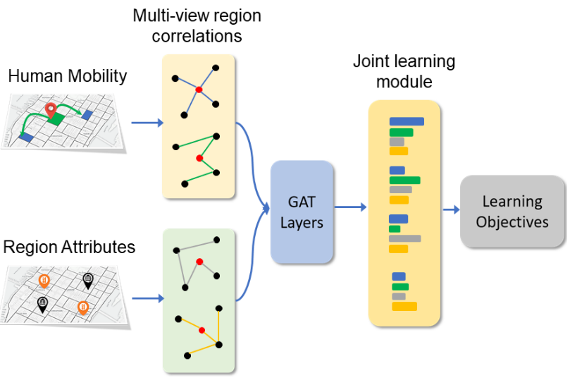
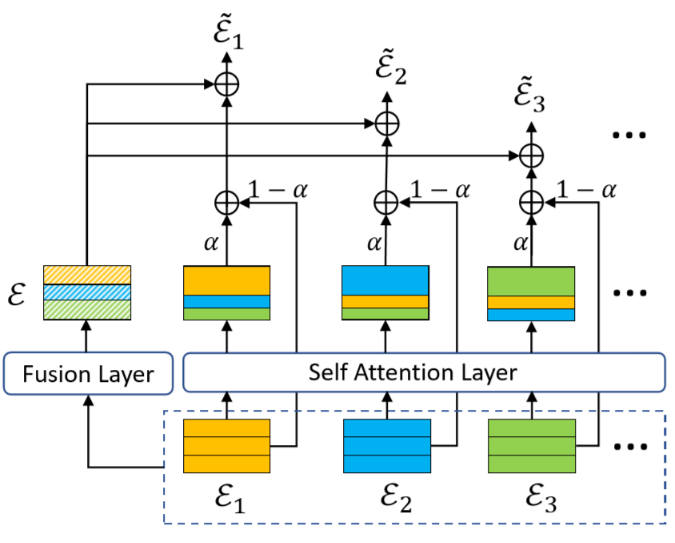
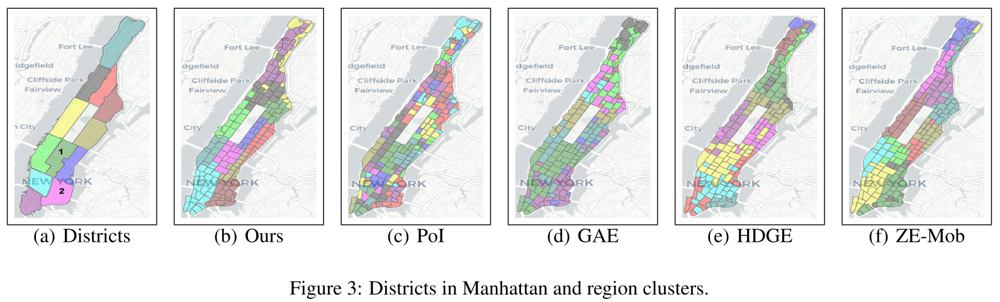
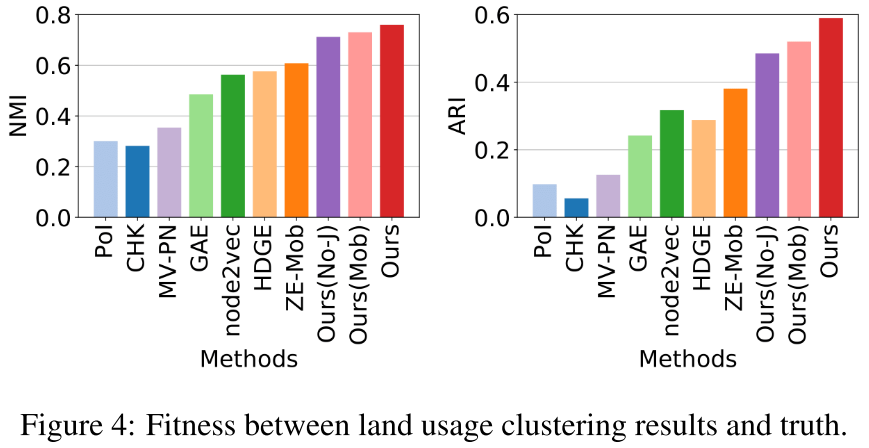
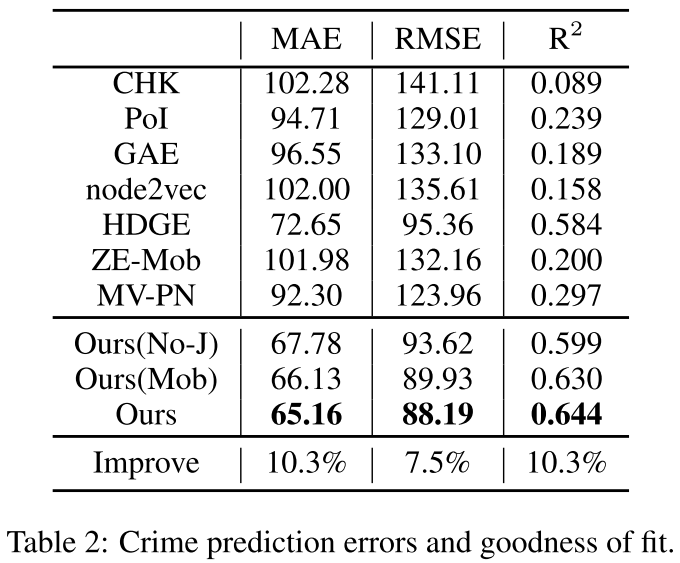

## Multi-View Joint Graph Representation Learning for Urban Region Embedding

### Abstract

越来越多的城市数据使我们能够调查城市的动态变化，指导城市规划，从而使我们的城市变得更加宜居和可持续化发展。在这篇文章中，我们关注如和从城市数据和城市区域中学习嵌入空间。我们首次提出了一种多视角联合学习模型（multi-view joint learning model）来学习全面的、有代表性的城市区域嵌入。我们首先基于人口的流动和区域的固有属性来建立不同类型的区域关联模型。然后从建立的相关性的各个角度使用图注意力模型来学习区域的嵌入。此外，我们还引入了一个联合学习模块，通过共享交叉信息（cross-view information）来促进区域嵌入学习，并通过学习自适应权值来融合多维度嵌入（multi-view embeddings）。最后，我们将学习到的嵌入应用在城市用地类型和犯罪预测的下游应用中，其具有真实世界数据。大量的实验结果表明，利用我们提出的联合学习模型，在两个任务上的性能与目前最先进的方法相比都有很大的提高。

### Introduction

研究城市区域的定量表示可以帮助我们更好地探索城市属性的相关性，并为城市结构和动态变化提供有价值的见解。此外，这种表示对下游任务也有很大的价值。

而随着技术的进步，各种数据源的数据量爆增，为城市区域嵌入提供了机会。

在现有的工作中，轨迹和车辆交通常用于区域的表示。但有一部分文章仅基于单一维度（single-view），性能低下。也一些研究试图将区域属性与人类移动数据结合起来，但是一方面不同的维度结合得过于简单和平等；另一方面维度间的协同在其间也没有体现，忽视了不同维度之间的信息交互。

在本文中，我们提出一个联合表示学习框架，基于人口的流动和区域的固有属性，使用 GNN 来产生更鲁棒的区域嵌入。具体来说，本文的贡献主要有

1. 研究城市区域表示问题，从多个维度探索城市环境中的区域相关性。
2. 提出了一种结合多维度区域关联的联合学习模型来学习综合区域嵌入。
3. 进行了大量的实验来评估模型在真实世界数据中的效果。

### Problem Statement & Methodology

定义人口移动的数据集为 $\mathcal{M} = \{m_0, m_1, \cdots, m_{|\mathcal{M}|} \}, ~ m = (r_s, r_d), ~ \forall m \in \mathcal{M}$，其中 $m$ 记录移动的起点和终点；区域的固有特征用向量 $a_i$ 表示，固有特征集合为 $\mathcal{A} = \{a_1, a_2, \cdots, a_n\}, ~ A \in \mathbb{R}^F, ~ \forall a \in \mathcal{A}$，包括 POIs 和打卡记录等多种特征；区域的低维向量表示为 $e_i$，集合记为 $\epsilon = \{e_1, e_2, \cdots, e_n\}, ~ e \in \mathbb{R}^d, ~ \forall e \in \epsilon$。

下面是模型的基本框架图：**提取相关性 $\Rightarrow$ GAT 信息传播 $\Rightarrow$ 注意力机制信息融合 $\Rightarrow$ 学习目标监督**。

#### Multi-view Correlation Modeling

通过人口流动和区域属性建立区域之间的关联。***对于人口流动***，这基于一个事实：接收来自相同来源的人流或将人流发送到相同目标的区域通常扮演相似的角色，并且从人口流动的观点来看，它们之间的距离很近。通过 $\mathcal{M}$，我们可以得到权重

$$
w_{r_j}^{r_i} = |\{(r_s, r_d) \in \mathcal{M} \mid r_s = r_i, r_d = r_j\}|
$$

则源和汇的条件分布可以写成

$$
p_s(r \mid r_i) = \frac{w_{r_i}^r}{\sum_t w_{r_i}^t}, ~~  p_d(r \mid r_i) = \frac{w_r^{r_i}}{\sum_t w_t^{r_i}}
$$

那么区域 $i$ 和 $j$ 的相似度可以通过源和汇的条件分布来刻画，

$$
\mathcal{C}_{s(d)}^{ij} = \mathbf{sim} (p_{s(d)}(r \mid r_i),~ p_{s(d)}(r \mid r_j))
$$

其中 $\mathbf{sim}$ 为余弦相似度，$\mathcal{C}_s^{ij}$ 为源相关性，$\mathcal{C}_d^{ij}$ 为汇相关性。

***对于区域属性***，考虑了 POIs 和打卡数据两种属性。具体将一个区域的 POIs 和打卡数据对应的 POIs 对所有不同的 POI 类别作 TF-IDF 得到向量 $a_i$。相似度为

$$
\mathcal{C}^{ij} = \mathbf{sim}(a_i, a_j)
$$

从而得到 POI 相关性 $\mathcal{C}_{poi}$ 和打卡数据相关性 $\mathcal{C}_{chk}$。

#### Base Model

构造图 $\mathcal{G}(\mathcal{V}, \mathcal{N})$，$v_i$ 表示每个区域，$N_i$ 是一个集合表示每个区域的最近的 $k$ 个区域（通过相关性 $\mathcal{C}$ 获取）。根据不同相关性指标构造图 $\mathcal{G}_s,~ \mathcal{G}_d, ~ \mathcal{G}_{poi}, ~\mathcal{G}_{chk}$。之后使用 GAT（graph attention network）学习顶点的向量表示，得到 $\epsilon_s,~ \epsilon_d, ~ \epsilon_{poi}, ~\epsilon_{chk}$。

#### Joint Learning Module

不同的相关性之间有关联，这一部分将上面的各个 $\epsilon$ 融合起来，框架如下

先将 $M$ 个不同维度的相关性 $\{\epsilon_i \in \mathbb{R}^{n \times d}\}_{i = 1}^M$ 通过自注意力机制得到 $\{\hat{\epsilon}_i\}_{i = 1}^M$，之后输出

$$
\epsilon_i' = \alpha \hat{\epsilon}_i + (1 - \alpha)\epsilon_i
$$

之后 *为了获取更全面的区域信息*，通过 $\{\epsilon_i \in \mathbb{R}^{n \times d}\}_{i = 1}^M$ 得到 *自适应* 融合层，

$$
\epsilon = \sum_{i = 1}^M w_i\epsilon_i, ~~ w_i = \sigma(\epsilon_iW_f + b_f)
$$

最后将上述两者组合

$$
\tilde{\epsilon}_i = \frac{\hat{\epsilon}_i + \epsilon}{2}
$$

得到嵌入 $\tilde{\epsilon}_s,~\tilde{\epsilon}_d,~\tilde{\epsilon}_{poi},~\tilde{\epsilon}_{chk}$。

#### Learning Objectives

设计了两种任务来对上述网络进行训练，分别为

* 源和目标预测：令区域表示为 $\epsilon_s = \{e_s^i\}_{i = 1}^n$ 和 $\epsilon_d = \{e_d^i\}_{i = 1}^n$，则最小化已知源预测汇和已知汇预测源的误差的和，即
$$
\mathcal{L}_{mob} = \sum_{(r_i, r_j) \in \mathcal{M}} -\log \hat{p}_s(r_j \mid r_i) - \log \hat{p}_d(r_i \mid r_j)
$$ 
$$
\hat{p}_s (r_j \mid r_i) = \frac{\exp({e_s^i}^T e_d^j)}{\sum_j\exp({e_s^i}^T e_d^j)}
$$
* 地区关系重建：目的是让嵌入根据不同的区域属性保留区域相似性，即最小化
$$
\mathcal{L}_{poi} = \sum_{i,j}(\mathcal{C}_{poi}^{ij} - {e_{poi}^i}^T e_{poi}^j)^2
$$

总的误差函数为 $\mathcal{L} = \mathcal{L}_{mod} + \mathcal{L}_{poi} + \mathcal{L}_{chk}$。

### Experiment

使用两个下游任务：城市用地类型（聚类）与犯罪预测（Lasso 回归）。

### Extra Information

* 代码：https://github.com/mingyangzhang/mv-region-embedding 。
* 数据集：http://opendata.cityofnewyork.us/data ，纽约公开数据集。出租车信息只有起终点。

### Comment

* 文章中不同的数据源（如轨迹，车辆交通，POIs 和打卡记录等），被称为多维度（multi-view），但没有视觉信息，否则可以吹成多模态，可惜。
* 公式错误有点多呀（黄色标明）。
* 在 GAT 中，每个顶点的初始权值应该为求相关性中用到的向量（即 $p_s, ~ a_i$，从向量维度可以推断），虽然文章没有细说。
* 最后的目标函数，相当于将 $s,~t,~poi,~chk$ （即人口流动和区域属性）的误差相加，根据不同的属性性质，采用不同的误差函数。