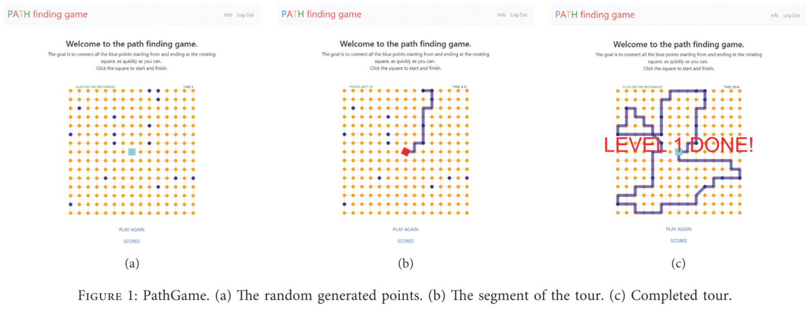
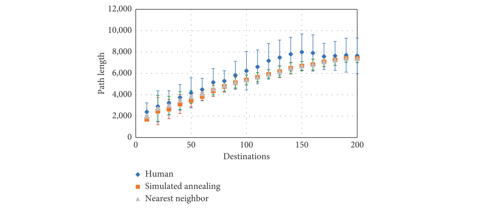
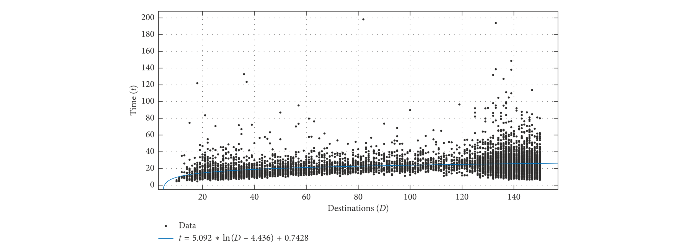

## PathGame: Crowdsourcing Time-Constrained Human Solutions for the Travelling Salesperson Problem

### Introduction

TSP 问题的最优解的决策 80% 的情况可以用最近邻策略来解释。

有研究通过从凸包逐步优化到 TSP 的思路对人类决策进行采集，从而学习到人类是如何解决 TSP 问题的（human TSP solving）。研究表明，在欧几里得和非欧几里得度量中，人类都能得到不错的解。

本文通过一个电子游戏来收集人类解决以曼哈顿距离为度量的 TSP 问题的步骤，并对其进行分析。

### Method

设计了一个如下的网页游戏

游戏根据点数（Destinations，记为 D）的多少分为不同的 LEVEL，并对每个收集到的解打分 

$$
\mathrm{score} = (C_1 + C_2 \times D - \frac{l}{D} - t)
$$

其中 l 为解的长度，t 为求解时间。

### Result

人类智慧、模拟退火和最近邻策略生成的解比较如下

不同点数 TSP 解决时间如下

在论文里最离谱的是在 150 ~ 200 这一段区间里，作者的数据不但说明求解的时间几乎没有变化且最优长度在不断减少。作者分析了一波，然后得出结论：是玩这个游戏的同学的问题。

#### Comment

* 这篇文章感觉亮点在于使用电子游戏来收集数据，虽然貌似有点常用，不过似乎心理学那边用得比较多。
* 分析有点扯。作者在拟合 D 与 t 的函数的时候枚举了一堆可用的函数如 $y = a \ln (x + c) + b$、$y = ax + b$、$y = ax\ln(x + c) + b$ 和 $y = a (x + c)^2 + b$ 等，然后取 RMSE 最小的函数作为最优的拟合函数（emmmmm）。
* 以曼哈顿距离作为度量的 TSP 问题的研究有点少，这篇文章是看到的第一篇，也有点偏调研性质。