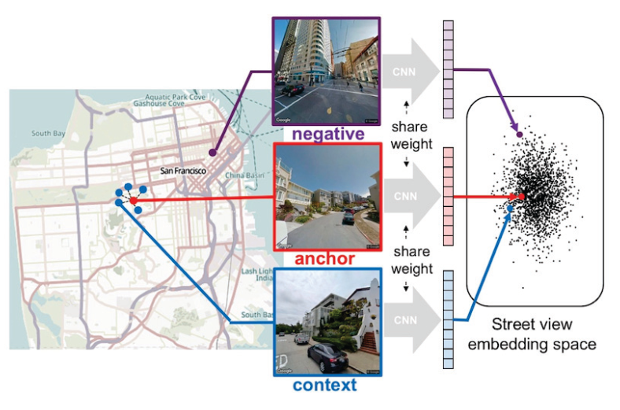
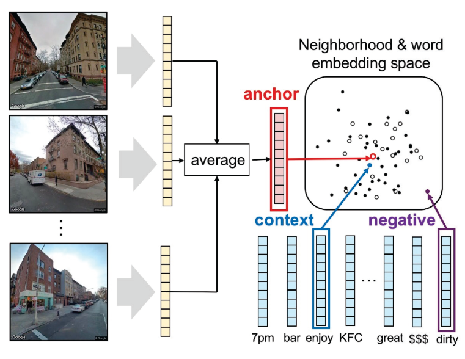
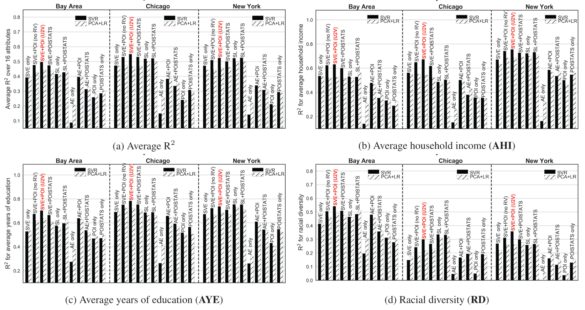
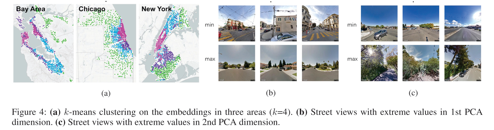
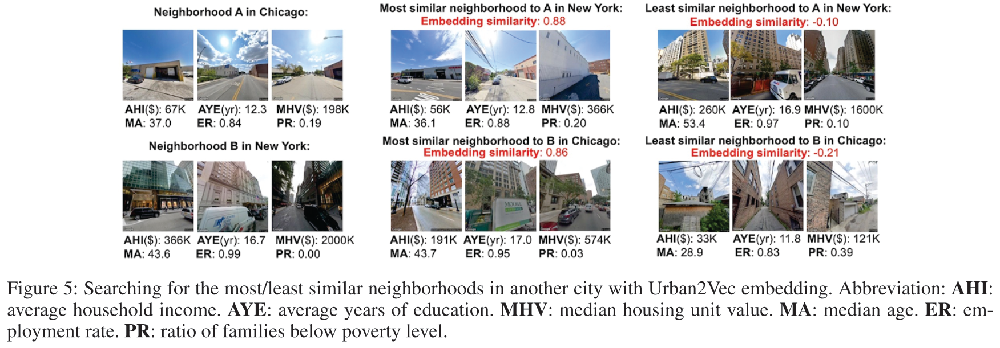

## Urban2Vec: Incorporating Street View Imagery and POIs for Multi-Modal Urban Neighborhood Embedding

### Abstract

要理解城市的内在模式并预测城市的时空特征，就需要对城市社区进行全面的表征。现有的研究依赖于区域间或区域内的连接来生成社区表示，但未能充分利用社区内信息丰富但异质的数据。我们提出的 Urban2Vec 是一个无监督的多模态框架，融合了街景图像和 POI 数据去学习社区的嵌入。具体来说，我们在使用卷积神经网络从街景图像中提取视觉特征的同时，保持了地理空间相似性。更多的，我们将 POI 建模成 BoW 的形式，其包含类别（category）、级别（rating）和额外信息（reveiw formation）。类似于自然语言处理中的文档嵌入，我们在向量空间中建立了社区（“文档”）和其周围 POIs 中的单词之间的语义相似度。通过将视觉、文本和地理空间信息共同编码到社区表示中，Urban2Vec 可以达到更好的性能，且在下游预测任务中可以与全监督方法相媲美。在美国 3 个大都市区域的大量实验也证明了模型的可解释性、泛化能力及其在社区相似性分析中的价值。

### Introduction

城市社区特征和动态变化的表示和理解对下游任务至关重要，传统的人力调查不但会花费大量的资金，而且明显会落后于现实世界城市的变化。

与社区相关的信息（POIs，社交平台文章和卫星图像等）可以用来预测或解释人口统计学和社会经济模式中的诸多问题。然而，现在大多数关于城市特征的研究都基于特定任务。

我们希望，在不需要大量标记数据的情况下，学习城市社区的多用途表示，即在保留与城市属性的关联的情况下进行社区嵌入。其关键是从数据中定义并获取其相似性，同时编码成向量。

而目前还没有一项工作充分利用了社区内丰富的 ***多模态信息*** ，并将它们合并在一起来生成社区表示。具体来说，我们的贡献有三方面：

1. 我们开发了一个 ***多模态和多阶段*** 的框架来生成融合了图像和文本数据的社区表示。不像普通的多模态以建立不同模态之间的关联，这里的主要目标是建立社区（container）和其内部对象（如卫星或街景图像、POI 等）之间的关联。
2. 通过大量的实验证明了方法的泛化能力。
3. 将纽约和芝加哥的社区映射到相同的矢量空间中，并说明为何 Urban2Vec 获得的嵌入表示可以用来绘制不同城市的社区之间的相似性。

### Problem Statement & Methodology

城市中的所有社区可以表示成集合 $\mathcal{R} = \{r_1, r_2, \cdots, r_N\}$，每个社区 $r_i$ 包括街景图片集合 $\mathcal{S}_i = \{s_{i1}, s_{i2}, \cdots, s_{iM_i} \}$ 和 POI 集合 $\mathcal{P}_i = \{p_{i1}, p_{i2}, \cdots, p_{iO_i} \}$。其中每个 POI $p$ 可以被描述成词袋 $\{t_1, t_2, \cdots, t_q\}$，词语从 $p$ 的分类、评级、价格和客户评论中提取。$r_i$ 中的 POI 集合也能表示为 $\tau_i = \{t_{i1}, t_{i2}, \cdots, t_{iH_i}\}$，为其中所有的 POI 的词袋的并集。

则社区表示问题可以描述为：给定 $\mathcal{R}, \mathcal{S}_i, \tau_i$，需要给出 $r_i$ 的向量表示 $z_i \in \mathbb{R}^d$。

在模型中，每张街景图片 $s_{ij}$ 被编码为 $x_{ij} \in \mathbb{R}^d$，每个 POI BoW 向量 $\tau_{ij}$ 被编码为 $y_{ij} \in \mathbb{R}^d$，目标是最小化向量空间中的欧几里得距离

$$
L_{nb-sv} = \sum_{i = 1}^N \sum_{j = 1}^{M_i} \mathbf{dist}(z_i, x_{ij}) ~~~~ s_{ij} \in \mathcal{S_i}
$$
$$
L_{nb-poi} = \sum_{i = 1}^N \sum_{j = 1}^{H_i} \mathbf{dist}(z_i, y_{ij}) ~~~~ t_{ij} \in \mathcal{\tau_i}
$$

在实际训练中，由于最小化 $L_{nb-sv}$ 比最小化 $L_{nb-poi}$ 涉及到更多的参数，使得两个方面同步收敛变得困难。从而采用两阶段的训练方式，即先最小化 $L_{nb-sv}$，再最小化 $L_{nb-poi}$。

#### Incorporating Street View Imagery（$L_{nb-sv}$）

为了减少在向量空间中出现孤立点的情况，我们最小化每张街景和其相邻街景之间的距离，即

$$
L_{sv-sv} = \sum_k \sum_{x_c \in \mathcal{N}_k} \mathbf{dist}(x_k, x_c)
$$

这基于假设：地理距离小的街景比距离大的街景之间更有可能共享相同的语义。在训练时，我们以三元组 $(s_a, s_c, s_n)$ 来作为输入，$s_a$ 作为靶图像，$s_c$ 作为相似图像，$s_n$ 作为不相似图像。使用同一个 CNN 模型参数来编码这三个图像，并最小化

$$
L_{sv-sv}^{tri}(x_a, x_c, x_n) = [m + ||x_a - x_c||_2 - ||x_a - x_n||_2]_+
$$

其中 $m$，用来防止这两个距离之间学习出现无限大的差异。

之后在固定 $x_k$ 的情况下最小化 $L_{nb-sv}$，最小的解析解为

$$
z_i = \frac{1}{M_i} \sum_{j = 1}^{M_i} x_{ij} ~~~~ s_{ij} \in \mathcal{S}_i
$$

#### Incorporating POI Textual Data（$L_{nb-poi}$）

POI 的词嵌入通过词嵌入矩阵 $Y \in \mathbb{R}^{|C| \times d}$ 来获取。我们同样使用三元组 $(r_a, t_c, t_n)$ 作为输入来加入 POI 的影响，其中 $r_a$ 是靶社区，$t_c$ 是 $r_a$ 之中的词，$t_n$ 是 $r_a$ 之外的词。最小化

$$
L_{nb-poi}^{tri}(z_a, y_c, y_n) = [m' + ||z_a - y_c||_2 - ||z_a - y_n||_2]_+
$$

从而来进一步训练社区表示 $Z$ 和 POI 词嵌入 $Y$。

### Experiment

实验分为

1. 下游任务的应用表现：下游任务使用 SVR 和 PCA+LR 两种传统方法进行实验。

2. 社区表示的可解释性：对三个大地区的社区的向量表示进行了 4 聚类，发现类似社区聚集较明显；用 PAC 的两个主成分对街景进行了可视化，发现第一成分与街道围护有关，而第二成分与植被有关。

3. 社区相似度分析：两个不同城市（纽约和芝加哥）之间的社区的相似度分析。

CNN 架构为 Inception-v3，使用了 ImageNet 的预训练参数；POI 词嵌入使用了 GloVe 的预训练参数；其余参数为随机初始化。

### Extra Information

* 无代码。
* 数据集：街景图由 Google 街景获取，POI 由 Yelp Fusion 的 API 得到。数据集未公开。

### Comment

* 我理解的是整个训练过程分为两个阶段：街景训练和 POI 训练。文中虽然提到 “*keeping all $x_{ij}$ fixed*”，但应该只是指在第一阶段的训练中固定。在第二阶段的训练中会对 $z_i$ 进行调整以最小化 $L_{nb-poi}^{tri}$，这一部分会直接反馈到生成 $x_{ij}$ 的 CNN 上。
* 本质上相当与以图片信息作为输入（预训练？），再参照 POI 进行 finetune。
* 实验很全，基本面面俱到。Appendix 里还有关于维度 $d$ 的实验，但没有仔细看。